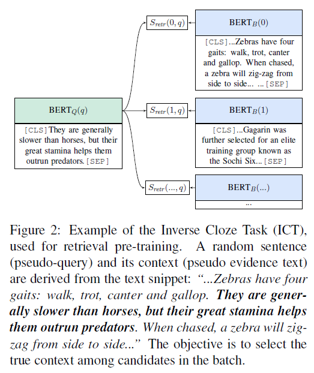

### Test code for "Inverse Cloze Task (ICT) passage retrieval" used in the following works
- [Latent Retrieval for Weakly Supervised Open Domain Question Answering](https://arxiv.org/abs/1906.00300)
- [GOING BEYOND TOKEN-LEVEL PRE-TRAINING FOR EMBEDDING-BASED LARGE-SCALE RETRIEVAL](https://openreview.net/forum?id=rkg-mA4FDr)

### Experiment
- Questions and passages from **SQuAD dataset**  are used for measuring passage retrieval performance.

**Retrieval accuracy**

| Rank | TF-IDF | ICT | TF-IDF + ICT |
|--|--:|--|--:|
|1| 49.24% | 25.91% |  57.77% |
|2| 60.24% | 37.14% |  69.75% |
|3| 66.41% | 43.36% |  75.21% |

- As mentioned in many previous works, token matching based methods like **TF-IDF** and **BM25** are sill powerful for retrieval system. 
- The result is promising considering ICT model used in this test can be much more improved.
- Simple **ensemble of TF-IDF and ICT** show much more improved performance thanks to semantic alignment.

### Further improvement
- In this test, **unsupervised training of ICT** was only performed on the passages in the SQuAD dataset. Additional training with **large unlabeled corpus** will greatly boost up the performance of model.
- As mentioned in the original paper, the model can be **fine-tuned** with **annotated question-passage pairs**.

